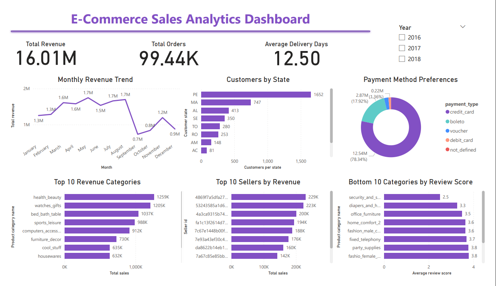

# Customer Sales Analytics Dashboard

A business intelligence project analysing the Olist Brazilian E-Commerce dataset using PostgreSQL and Power BI. The goal is to answer key business questions about revenue, customers, sellers, delivery performance, and customer satisfaction.

## Dashboard Preview

## Approach

- Loaded the raw dataset into a PostgreSQL database and structured the data to remove inconsistencies
- Wrote SQL queries to extract insights across revenue, customers, sellers, delivery, and customer satisfaction
- Built an interactive Power BI dashboard connected directly to the database, featuring KPI summary cards and a date slicer

## Key Findings

- Total revenue across the period was R$16.01M across 99,441 orders
- Revenue grew consistently from R$59K in October 2016 to over R$1.1M per month by early 2018
- Health & Beauty was the top revenue category at R$1.26M, followed by Watches & Gifts at R$1.2M
- Sao Paulo state accounts for 41,746 customers, more than three times the second largest state
- The average delivery time was 12.5 days across all delivered orders
- 73.9% of customers paid by credit card, with Boleto (cash slip) second at 19%
- Security & Services had the lowest average review score at 2.5 out of 5

## Recommendations

- Invest marketing and inventory resources in Health & Beauty and Watches & Gifts as the highest revenue categories
- Focus customer acquisition efforts in Sao Paulo, Rio de Janeiro and Minas Gerais where demand is highest, while treating lower-performing states as growth opportunities
- The 12.5 day average delivery time is high for an e-commerce platform and warrants a review of logistics and fulfilment processes, particularly for furniture and large item categories which also had the worst review scores
- Given that 74% of customers pay by credit card, improving the installment payment experience could drive higher average order values
- The Security & Services category needs urgent investigation as a 2.5 out of 5 average review score indicates a systemic issue with either product quality or service delivery

## Conclusion

This project demonstrates how raw transactional data can be transformed into actionable business intelligence. By combining SQL for data analysis with Power BI for visualisation, the dashboard gives business stakeholders a clear view of performance across revenue, geography, logistics, and customer satisfaction, enabling faster and more informed decision making.

## Tools Used

- PostgreSQL for data storage and SQL analysis
- DBeaver as the SQL client
- Python and SQLAlchemy for loading the CSV data into PostgreSQL
- Power BI for dashboard visualisation

## Let's Connect!

If you have feedback, suggestions, or want to collaborate on a data project, feel free to reach out.

[GitHub](https://github.com/noelle-mburu) · [LinkedIn](www.linkedin.com/in/noelle-mburu)
